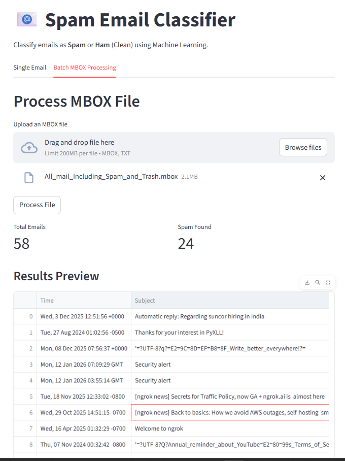

# 📧 Spam Email Classification System


<!--  -->

This is how our app looks like, where you can paste your email in text or upload your mbox file and get all details on whether it is spam or ham.

A production-ready machine learning application designed to classify emails as **Spam** or **Ham** (Legitimate). This project features a modular pipeline architecture for seamless data processing, model training, and real-time inference, all integrated into a modern Streamlit web interface.

## 🚀 Key Features

- **End-to-End ML Pipeline**: Modularized components for data ingestion, transformation, model training, and prediction.
- **Support for Multiple Models**: Evaluates and compares performance across algorithms including SVM, Logistic Regression, Decision Trees, KNN, and Random Forest.
- **Interactive Web UI**: Real-time single email analysis and bulk MBOX file processing.
- **MBOX Archive Support**: Native capability to parse and classify entire email databases from `.mbox` files.
- **Scalable Architecture**: Built with modern Python tools for reliability and ease of extension.

## 🛠️ Tech Stack

- **Python**: 3.12+
- **Frontend**: [Streamlit](https://streamlit.io/)
- **ML Framework**: [Scikit-learn](https://scikit-learn.org/)
- **Data Handling**: Pandas, BeautifulSoup4
- **Package Management**: [uv](https://github.com/astral-sh/uv) (Recommended)

## 📂 Project Structure

```
├── app.py                  # Streamlit Web Application
├── pyproject.toml          # Project configuration and dependencies
├── uv.lock                 # Lockfile for reproducible environments
├── src/
│   ├── components/         # Core processing (Ingestion, Transformation, Training)
│   ├── pipeline/           # Orchestration (Training and Prediction Pipelines)
│   ├── config/             # Hyperparameters and file path configurations
│   └── utils/              # Logging, Exception handling, and helper functions
├── data/
│   ├── dataset/            # Raw datasets and MBOX files
│   └── processed/          # Cleaned/Transformed data artifacts
├── outputs/                # Trained models, vectorizers, and experiment results
└── logs/                   # System runtime and error logs
```

## ⚡ Installation

### 1. Clone the Repository
```bash
git clone <repository_url>
cd spam_detect
```

### 2. Set up Environment
It is recommended to use `uv` for lightning-fast dependency management:

```bash
# Using uv (Recommended)
uv venv
source .venv/bin/activate  # Windows: .venv\Scripts\activate
uv sync
```

Alternatively, using standard `pip`:
```bash
python -m venv .venv
source .venv/bin/activate  # Windows: .venv\Scripts\activate
pip install -r requirements.txt
```

## 🖥️ Usage

### 1. Launch the Web Interface
Run the Streamlit dashboard to interact with the models:

```bash
streamlit run app.py
```

- **Single Email Check**: Paste content directly to get a prediction and confidence score.
- **MBOX Batch Processing**: Upload an `.mbox` file to classify entire archives and download results as CSV.

### 2. Retraining the Models
To train the system on fresh data:

1. Update your dataset in `data/dataset/dataset.csv`.
2. Execute the training pipeline:
   ```bash
   python -m src.pipeline.training_pipeline
   ```
3. New artifacts (Model & Vectorizer) will be generated in the `outputs/` directory.

## ⚙️ Configuration

System parameters and model hyperparameters are centrally managed in `src/config/config.py`. You can modify:
- **Paths**: Update `model_path` and `feature_path` to point to specific versions.
- **Hyperparameters**: Tune settings for SVM, Logistic Regression, etc., for better accuracy.

## 📊 Model Evaluation

The system performs comprehensive evaluation using metrics such as **Accuracy**, **Precision**, **Recall**, and **F1-Score**. By default, it supports Grid Search to find the optimal parameters for the selected algorithm.

## 🤝 Contributing

1. Fork the Project
2. Create your Feature Branch (`git checkout -b feature/NewFeature`)
3. Commit your Changes (`git commit -m 'Add some NewFeature'`)
4. Push to the Branch (`git push origin feature/NewFeature`)
5. Open a Pull Request

## 📝 License

Distributed under the MIT License.
